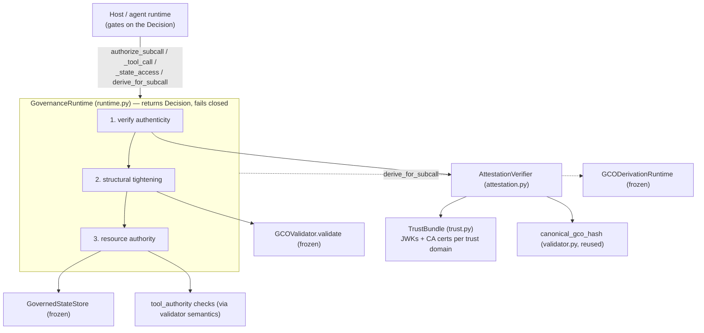
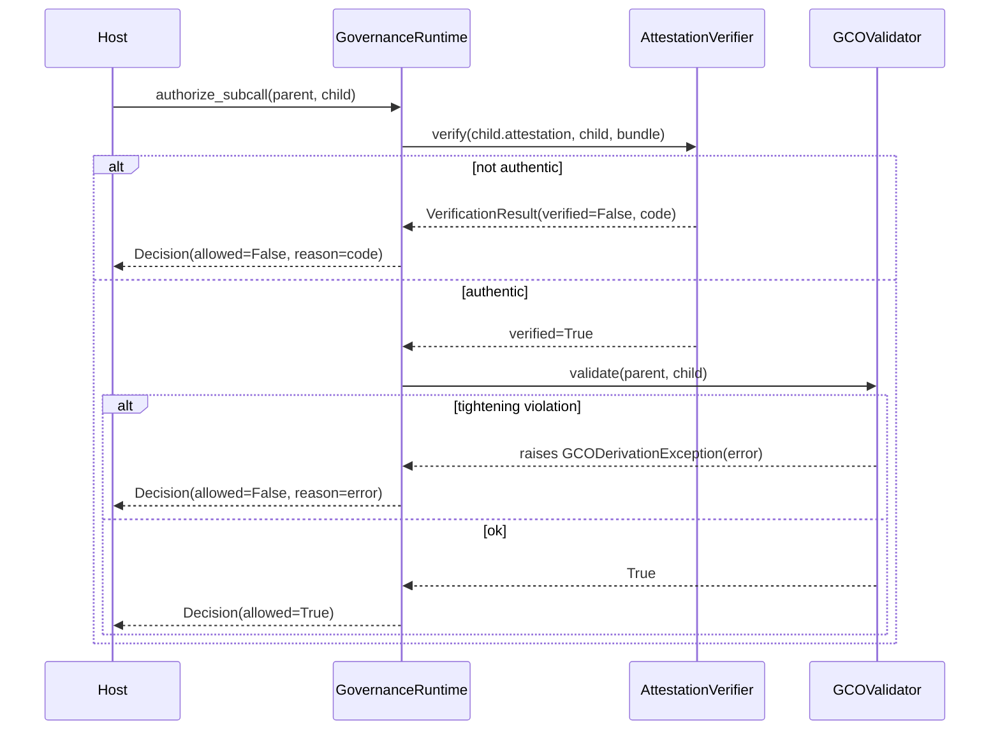

# feat: Attestation Crypto Verification + Runtime Enforcement Seam

Two sequenced milestones that moved GCO from *advisory* (structurally validates authority but trusts attestations on faith) to *enforcing* (authenticates the attestation cryptographically, then exposes a single tighten-or-deny decision point a host can gate on). Crypto is the trust anchor; the runtime seam composes it with the already-verified validator, derivation, and state-store layers.

**Execution posture:** security-critical and greenfield — implement adversarial-test-first. For each verifier and decision path, start from a failing test that a forged/tampered/expanded input is rejected, then make it pass. Delegate execution to Codex per the same pattern used for the state-store fixes.

---

## Summary

`validator.py`, `state_store.py`, and `derivation.py` were independently audited release-ready, but the system still **trusted attestations on presence + format only** — the README said so honestly, and `positioning.md` framed GCO as "a primitive that a runtime enforces." This plan delivered the two missing pieces:

1. **Milestone 1 — Attestation crypto verification.** A standalone `AttestationVerifier` establishes an attestation's *authenticity* (signature, key trust, identity binding, digest binding, expiry) against an offline trust bundle, for `jwt-svid` and `x509-svid`. `raw-jws` and `tpm-quote` fail closed as explicitly unverified.
2. **Milestone 2 — Runtime enforcement seam.** A transport-agnostic `GovernanceRuntime` composes verifier + validator + derivation + state store into `Decision`-returning chokepoint methods a host calls when a node spawns a sub-call, invokes a tool, or accesses governed state. It verifies authenticity first, then structural tightening, then resource authority — fail closed at each step.

MCP propagation and a CLI were explicitly out of scope for this seam milestone;
the follow-up P0 MCP adapter now lives in `src/gco_mcp/`.

---

## Problem Frame

GCO's whole job is keeping authority from silently widening as computation branches. Before this plan landed, a descendant's *structure* was checked (tightening, lineage, expiry), but its `attestation` was accepted if it merely had a supported `format` and a non-empty `value`. Any actor that could emit a well-shaped GCO was trusted — there was no cryptographic proof the attestation was issued by the claimed workload identity, nor that it bound to *this* GCO's contents. The implementation now adds that proof for `jwt-svid` and `x509-svid` and exposes a host-facing runtime seam for enforcement.

---

## Requirements

- **R1** — Verify `jwt-svid` and `x509-svid` attestations against an offline trust bundle: signature valid, signing key/chain trusted, SPIFFE identity matches the GCO's `model_identity`, payload binds `canonical_gco_hash(gco)`, attestation not expired relative to an injected clock.
- **R2** — Fail closed on every negative: bad signature, untrusted key, identity mismatch, digest mismatch, expired, unsupported format (`raw-jws`/`tpm-quote`), or malformed token material — return a result with a specific error code, never raise an uncaught exception, never report verified on doubt.
- **R3** — Keep the audited surfaces frozen. No behavioral change to `validator.py`, `state_store.py`, `derivation.py` security logic, or to `models.py` model fields. Compose, do not modify. Reuse `canonical_gco_hash`.
- **R4** — Expose a transport-agnostic runtime seam with chokepoint methods (`authorize_subcall`, `authorize_tool_call`, `authorize_state_access`, `derive_for_subcall`) that return a `Decision`, composing crypto → structural validation → resource authority in that order, failing closed.
- **R5** — A host wiring the seam into its call path must be unable to obtain an `allow` Decision for an unauthentic attestation or an authority-expanding action.
- **R6** — Honest documentation: README and `positioning.md` state exactly which formats are cryptographically verified vs declared-but-unverified, and that the seam is a decision point that depends on the host actually gating on it.
- **R7** — Maintain the project bar: full suite green at 100% branch coverage, plus dedicated fuzz harnesses proving "never verify a forgery / never allow an expansion / never raise uncaught" at ≥20k iterations.

---

## Key Technical Decisions

- **KTD1 — Offline trust bundle, not SPIRE.** Trust is a config-loaded `TrustBundle` (trust domain → trusted JWK set for JWS, and CA certificates for X.509). Rationale: self-contained reference implementation; SPIRE/workload-API is a deployment concern that can back the same interface later. *(confirmed scope fork)*
- **KTD2 — Verification is a standalone `AttestationVerifier`, composed by the runtime.** `validator.py` stays frozen (it was just certified; its audit explicitly scoped signature verification out). The verifier is called by the runtime seam, not folded into `validate()`. Rationale: preserve the audited contract; keep crypto independently testable in isolation.
- **KTD3 — Unify verified formats around JWS; bind to the canonical hash.** `jwt-svid` is a JWT compact token; `x509-svid` is verified as a JWS whose `x5c` header carries the leaf+intermediates, with the chain path-validated against the bundle CAs and the SPIFFE ID read from the leaf cert's URI SAN. Verified formats bind the GCO via a `gco_hash` claim equal to `canonical_gco_hash(gco)`. `raw-jws` remains declared but unsupported until a dedicated verifier is scoped. Rationale: one verification path for the implemented formats, reuses the existing canonical hash, avoids changing `AttestationModel` fields.
- **KTD4 — Use vetted libraries; never hand-roll signature verification.** X.509 path validation uses `cryptography`'s `x509.verification`. JWS/JWT signature verification uses `PyJWT` as a runtime dependency. Rationale: crypto correctness is the entire point of this milestone.
- **KTD5 — Unsupported formats fail closed, loudly.** `tpm-quote` (and `raw-jws` if not in the first cut) return `UNSUPPORTED_FORMAT` with `verified=False`. Rationale: honesty — "we do not verify this" must never read as "verified."
- **KTD6 — The seam is transport-agnostic and returns `Decision`s; the host enforces.** No MCP/HTTP/transport coupling. Composition order is fixed: authenticity → structural tightening → resource authority, fail closed at each. Rationale: MCP propagation stays a thin adapter; matches `positioning.md`'s "depends on deployment controls to be enforcing."
- **KTD7 — Injected clock, mirroring the validator.** The verifier and seam take a `now` callable (default `datetime.now(timezone.utc)`) so attestation-expiry is deterministically testable, exactly as `GCOValidator` already does.

---

## High-Level Technical Design

Layering — crypto anchors the stack; the seam is the single host-facing chokepoint:



Decision sequence for a sub-call (the core path):



Plan diagrams are authoritative for direction; prose governs on any disagreement.

---

## Output Structure

```text
src/gco/
  trust.py          # NEW — TrustBundle: load trusted JWKs + CA certs per trust domain
  attestation.py    # NEW — AttestationVerifier, AttestationError, VerificationResult
  runtime.py        # NEW — GovernanceRuntime, Decision (the enforcement seam)
tests/
  test_trust.py            # NEW
  test_attestation.py      # NEW
  test_runtime.py          # NEW
audit_attestation_fuzz.py  # NEW — forged/garbage token material never verifies, never crashes
audit_runtime_fuzz.py      # NEW — no Decision allows unauthentic or expanding actions
```

The per-unit `**Files:**` sections are authoritative; the tree is the expected shape.

---

## Implementation Units

### Phase A — Milestone 1: Attestation crypto verification

### U1. Trust bundle loading
- **Goal:** A `TrustBundle` that holds, per trust domain, the trusted JWK set (for JWS verification) and CA certificates (for X.509 path validation), loaded from an in-memory mapping and/or a config file.
- **Requirements:** R1, R3 (additive, no model change).
- **Dependencies:** none.
- **Files:** `src/gco/trust.py`, `tests/test_trust.py`.
- **Approach:** Immutable value object keyed by trust domain. JWKs parsed into public-key objects; CA certs parsed into a `cryptography` Store for `x509.verification`. Loader raises a controlled error on malformed key/cert material — never a bare parser exception. No network, no SPIRE.
- **Patterns to follow:** `models.py` strict construction style; controlled-exception discipline from `state_store.py` (`StateKeyNotFound` subclassing).
- **Test scenarios:**
  - Happy: load a bundle with one trust domain holding a JWK set and a CA cert; lookups return the expected keys/store.
  - Edge: empty bundle; unknown trust domain lookup returns a clear "no trust anchors" signal (not `KeyError`).
  - Error: malformed JWK JSON and malformed PEM each raise a controlled `TrustBundleError`, not a bare exception.
- **Verification:** bundle constructs from fixtures; malformed inputs rejected with a typed error; unknown-domain lookup is a controlled miss.

### U2. JWS-based verifier core (jwt-svid path)
- **Goal:** `AttestationVerifier.verify(attestation, gco, *, now=...)` that verifies a compact JWT-SVID: signature against a trusted JWK, `gco_hash` claim equals `canonical_gco_hash(gco)`, SPIFFE ID (sub) equals `gco.model_identity`, and the attestation is not expired.
- **Requirements:** R1, R2, R3, R7, KTD3, KTD4, KTD7.
- **Dependencies:** U1.
- **Files:** `src/gco/attestation.py`, `tests/test_attestation.py`.
- **Approach:** Define `AttestationError` (enum: `UNVERIFIED_SIGNATURE`, `UNTRUSTED_KEY`, `SPIFFE_ID_MISMATCH`, `GCO_DIGEST_MISMATCH`, `EXPIRED_ATTESTATION`, `UNSUPPORTED_FORMAT`, `MALFORMED_ATTESTATION`) and a frozen `VerificationResult(verified, error_code, message)`. Reuse `canonical_gco_hash` from `validator.py` — do not reimplement. All token parsing wrapped so malformed material yields `MALFORMED_ATTESTATION`, never an uncaught exception. Fail closed: any check fails ⇒ `verified=False`.
- **Execution note:** Start from failing tests that a tampered payload and a wrong-key signature are rejected, then implement.
- **Patterns to follow:** `GCOValidator`'s injected-clock pattern (`self._now`); `ValidationResult` shape in `validator.py` for the result object.
- **Test scenarios:**
  - Happy: a correctly signed jwt-svid binding the right digest + identity verifies (`verified=True`).
  - Tamper: mutate one byte of the GCO after signing ⇒ `GCO_DIGEST_MISMATCH`.
  - Wrong key: token signed by a key absent from the bundle ⇒ `UNTRUSTED_KEY`.
  - Bad signature: valid structure, corrupted signature ⇒ `UNVERIFIED_SIGNATURE`.
  - Identity: `sub` SPIFFE ID ≠ `model_identity` ⇒ `SPIFFE_ID_MISMATCH`.
  - Expiry: token `exp` before injected `now` ⇒ `EXPIRED_ATTESTATION` (clock injected, deterministic).
  - Malformed: `value` is not a JWS / garbage base64 ⇒ `MALFORMED_ATTESTATION`, no crash.
- **Verification:** every negative returns the specific code; the happy path verifies; no path raises.

### U3. X.509-SVID chain verification
- **Goal:** Verify `x509-svid`: path-validate the leaf+intermediates (carried in the JWS `x5c` header) against the bundle CAs using `cryptography.x509.verification`, read the SPIFFE ID from the leaf's URI SAN, verify the JWS signature with the leaf key, and apply the same digest/identity/expiry bindings as U2.
- **Requirements:** R1, R2, R3, KTD3, KTD4.
- **Dependencies:** U1, U2.
- **Files:** `src/gco/attestation.py` (extend), `tests/test_attestation.py` (extend).
- **Approach:** Build a `PolicyBuilder`/`Store` verification against the trust domain's CAs (API confirmed available in `cryptography` 49). Map chain-validation failure, missing/foreign URI SAN, and untrusted root onto the existing `AttestationError` codes (untrusted root ⇒ `UNTRUSTED_KEY`; bad SAN ⇒ `SPIFFE_ID_MISMATCH`). Reuse the U2 digest/identity/expiry checks once the leaf key is trusted.
- **Execution note:** Start from a failing test that a chain to an untrusted root is rejected.
- **Patterns to follow:** U2's result/error shape; keep one `verify()` entry that dispatches by `attestation.format`.
- **Test scenarios:**
  - Happy: leaf signed by an intermediate chaining to a trusted CA, correct URI SAN ⇒ verifies.
  - Broken chain: missing intermediate / chain to an untrusted root ⇒ `UNTRUSTED_KEY`.
  - SAN: leaf has no SPIFFE URI SAN, or SAN ≠ `model_identity` ⇒ `SPIFFE_ID_MISMATCH`.
  - Digest/expiry: reuse U2 negatives on the x509 path to prove bindings apply post-chain-trust.
  - Malformed: non-PEM/garbage in `x5c` ⇒ `MALFORMED_ATTESTATION`, no crash.
- **Verification:** trusted chain verifies; every chain/SAN/binding failure returns the specific code; no uncaught exception.

### U4. Unsupported formats + crypto fuzz harness
- **Goal:** Make `tpm-quote` (and `raw-jws` if deferred from the first cut) fail closed as `UNSUPPORTED_FORMAT`, and add an adversarial fuzz harness proving forged/garbage attestations never verify and never crash.
- **Requirements:** R2, R5, R7, KTD5.
- **Dependencies:** U2, U3.
- **Files:** `src/gco/attestation.py` (finalize dispatch), `tests/test_attestation.py` (extend), `audit_attestation_fuzz.py`.
- **Approach:** Dispatch table over `AttestationFormat`; unsupported ⇒ `UNSUPPORTED_FORMAT`, `verified=False`. Fuzz (≥20k iters): random bytes, truncated JWS, valid-JWS-wrong-key, valid-signature-wrong-digest, expired, swapped-format; assert `verified=True` count is 0 and uncaught-exception count is 0.
- **Patterns to follow:** `audit_fuzz.py` structure (oracle + counters + RESULT line).
- **Test scenarios:**
  - `tpm-quote` ⇒ `UNSUPPORTED_FORMAT`, `verified=False`.
  - If `raw-jws` deferred: ⇒ `UNSUPPORTED_FORMAT`; else covered by U2.
  - Fuzz: 0 forgeries verified, 0 uncaught, over ≥20k iterations.
- **Verification:** `python audit_attestation_fuzz.py` ⇒ PASS (0 verified forgeries, 0 uncaught).

### Phase B — Milestone 2: Runtime enforcement seam

### U5. `Decision` + `GovernanceRuntime` skeleton with `authorize_subcall`
- **Goal:** A transport-agnostic `GovernanceRuntime` holding a verifier, a trust bundle, and a `GCOValidator`, exposing `authorize_subcall(parent, child) -> Decision` that verifies the child's attestation, then validates tightening, returning a fail-closed `Decision`.
- **Requirements:** R4, R5, R7, KTD2, KTD6, KTD7.
- **Dependencies:** U2, U3 (verifier); `GCOValidator` (exists).
- **Files:** `src/gco/runtime.py`, `tests/test_runtime.py`.
- **Approach:** `Decision(allowed: bool, reason: str | None, error_code)` (frozen). Order: `verify()` first; on `verified=False` return `Decision(allowed=False)` carrying the `AttestationError`; else call `validator.validate(parent, child)` inside a try and map `GCODerivationException.error` onto the Decision. Never raise out of the seam; malformed inputs ⇒ denied Decision. Inject `now` into both the verifier and validator it constructs.
- **Execution note:** Start from a failing test that an unauthentic child is denied even when its structure is a perfect tightening.
- **Patterns to follow:** `validate_result()` try/except-to-result pattern in `validator.py`; `der_harness.py` injected-collaborator style.
- **Test scenarios:**
  - Authentic + tightening ⇒ `allowed=True`.
  - Authentic + authority expansion ⇒ `allowed=False`, reason is the specific `DerivationError`.
  - Unauthentic (forged attestation) + perfect tightening ⇒ `allowed=False`, reason is the `AttestationError` (proves verify precedes validate).
  - Malformed child (raw dict, wrong types) ⇒ `allowed=False`, controlled, no raise.
- **Verification:** decisions correct for the four quadrants; seam never raises.

### U6. `authorize_tool_call` and `authorize_state_access`
- **Goal:** Resource-authority chokepoints: a GCO must be authentic and still valid as a standalone credential, then hold the requested authority — a tool URI within `tool_authority`, or a namespace/mode within `state_access_permissions` (delegating to `GovernedStateStore` semantics).
- **Requirements:** R4, R5, KTD6.
- **Dependencies:** U5; `GovernedStateStore` (exists).
- **Files:** `src/gco/runtime.py` (extend), `tests/test_runtime.py` (extend).
- **Approach:** Both verify authenticity first. `authorize_tool_call(gco, tool_uri)`: check `tool_uri` is present with `max_depth > 0` (reuse validator scope/`_scope_is_subset` semantics; do not duplicate the lattice). `authorize_state_access(gco, namespace, mode)`: consult the store's permission/taint rules via the existing store, mapping its exceptions onto denied Decisions. Self-credential validity reuses `validate_root`/expiry where applicable without modifying the validator.
- **Test scenarios:**
  - Tool: authentic GCO granting `tool_uri` ⇒ allow; tool absent ⇒ deny; `max_depth == 0` ⇒ deny.
  - State: authentic GCO with `write` on ns ⇒ allow write; `none`/missing ns ⇒ deny; tainted read ⇒ deny with the taint reason surfaced.
  - Unauthentic GCO ⇒ deny before any authority check, for both methods.
- **Verification:** allow only when authentic AND authorized; store taint/ACL reasons surface in the Decision; no raise.

### U7. `derive_for_subcall` round-trip
- **Goal:** Compose minting + verification: given a parent and a `DelegationRequest`, mint a tightened child via `GCODerivationRuntime`, and confirm the resulting child both verifies (crypto) and validates (structure) before returning it.
- **Requirements:** R4, R5, R3 (compose, don't modify derivation).
- **Dependencies:** U5; `GCODerivationRuntime` + `AttestationAuthority` (exist).
- **Files:** `src/gco/runtime.py` (extend), `tests/test_runtime.py` (extend).
- **Approach:** The runtime accepts an `AttestationAuthority` (the existing protocol) for minting. `derive_for_subcall` calls `GCODerivationRuntime.derive` (which already validates), then runs the verifier on the minted child against the trust bundle to prove the issued attestation is one the runtime would itself accept. Return a `Decision`-wrapped child or a denial; never raise.
- **Test scenarios:**
  - Valid request ⇒ child returned, and it independently verifies + validates.
  - Expanding request ⇒ derivation refuses; surfaced as a denied Decision with the `DerivationError`.
  - Authority that issues an untrusted attestation ⇒ minted child fails verification ⇒ denied (proves the round-trip is real, not assumed).
- **Verification:** every returned child passes both verifier and validator; refusals carry specific reasons.

### U8. Runtime fuzz + honest docs
- **Goal:** A property/fuzz harness proving no `Decision` ever allows an unauthentic or authority-expanding action and the seam never raises; plus README/`positioning.md` updates stating exactly what is verified vs unverified and that enforcement depends on the host gating on the Decision.
- **Requirements:** R5, R6, R7.
- **Dependencies:** U5, U6, U7.
- **Files:** `audit_runtime_fuzz.py`, `README.md`, `docs/positioning.md`.
- **Approach:** Fuzz random parents/children/requests with a mix of authentic/forged attestations and tightening/expanding structures; oracle asserts `allowed=True` ⇒ (authentic AND non-expanding); count uncaught = 0; ≥20k iters. Docs: add a "Cryptographic Verification" section listing `jwt-svid`/`x509-svid` as verified and `raw-jws`/`tpm-quote` as declared-but-unverified; update `positioning.md`'s "binds to an attested workload identity" line so it matches reality (verified for the supported pair; the seam is a decision point the host must enforce).
- **Patterns to follow:** `audit_fuzz.py` / `audit_state_fuzz.py` oracle+counter shape.
- **Test scenarios:** (harness, not pytest) 0 unauthentic-allowed, 0 expansion-allowed, 0 uncaught over ≥20k iters.
- **Verification:** `python audit_runtime_fuzz.py` ⇒ PASS; README/positioning no longer overstate current capability.

---

## Scope Boundaries

**In scope:** offline-trust-bundle verification of `jwt-svid` + `x509-svid`; a transport-agnostic enforcement seam composing the verified layers; fuzz harnesses; honest docs.

### Deferred to Follow-Up Work
- **MCP propagation** — a later adapter that wraps `GovernanceRuntime` at the MCP tool-call boundary (derive a child GCO per sub-call, attach + verify). Depends on this seam. Follow-up status: the P0 adapter now lives in `src/gco_mcp/`.
- **CLI** — a `gco verify/validate/derive` command surface. Independent usability layer; build only when an external consumer needs it.
- **`raw-jws` verification** — if not in the first cut, it remains `UNSUPPORTED_FORMAT` until scoped.
- **`tpm-quote` verification** — requires TPM quote/PCR attestation machinery; out of this milestone's identity model.
- **SPIRE / workload-API trust source** — can back the `TrustBundle` interface later without changing the verifier.
- **Revocation / key rotation** — bundle is static per run; rotation and revocation lists are future work.

### Not a Goal
- Modifying any security logic in `validator.py`, `state_store.py`, `derivation.py`, or fields in `models.py`.
- Making GCO enforcing *without host cooperation* — the seam returns Decisions; the host must gate on them (per `positioning.md`).

---

## Risks & Mitigations

- **Crypto correctness (highest).** A subtly wrong verifier that accepts forgeries is worse than none. *Mitigate:* vetted JOSE lib + `cryptography.x509.verification` (no hand-rolled signatures); adversarial-test-first; ≥20k forgery fuzz with a zero-verified gate.
- **Frozen-surface drift.** Composition accidentally changing validator/store/derivation behavior. *Mitigate:* additive-only new modules; rerun the existing five audit harnesses + full suite to prove no regression.
- **Honesty drift.** Docs implying more verification than exists. *Mitigate:* R6 doc updates are an explicit unit (U8); unsupported formats fail closed and loudly (KTD5).
- **Attestation-binding gap.** If `x5c`-in-JWS proves insufficient for x509-svid, a model field might be tempting. *Mitigate:* treat as Open Question; prefer keeping the chain inside `value`; if a field is truly required, it is additive/optional and re-audited separately — not a logic change.
- **Scope creep into SPIRE/MCP.** *Mitigate:* explicit deferral list above.

---

## Resolved Questions

- Exact JOSE library: resolved as `PyJWT`, listed in runtime dependencies.
- Exact `cryptography.x509.verification` API surface: resolved in the verifier implementation.
- SPIFFE identity binding field: resolved as `model_identity`.
- Attestation issuer hint: `AttestationModel.issuer` remains optional; no `kid` model field was added.

---

## Sources & Research

- **First-hand repo context (this session):** every source module, test, schema, `README.md`, and `docs/positioning.md` were read, and the full audit battery (`audit_attacks.py`, `audit_fuzz.py`, `audit_state_attacks.py`, `audit_state_fuzz.py`, `audit_derivation_roundtrip.py`) was run. `validator.py`/`state_store.py`/`derivation.py` are release-ready; `der_harness.py` is static scoring only.
- **Dependency probe (this session):** `cryptography` 49.0.0 installed with `x509.verification` available — X.509-SVID chain validation needs no new heavy dependency. `pydantic>=2.8` present. A JOSE/JWT lib is the one new runtime dependency anticipated (KTD4).
- **Not run:** a live external best-practices/docs pass and the `ce-repo-research-analyst`/`ce-learnings-researcher` sub-agents were intentionally skipped — the planner already has exhaustive first-hand context of this repo, and spawning would re-derive known state. Crypto library specifics (JOSE lib choice, exact `x509.verification` calls) are flagged above as execution-time confirmations rather than presented as externally verified.
